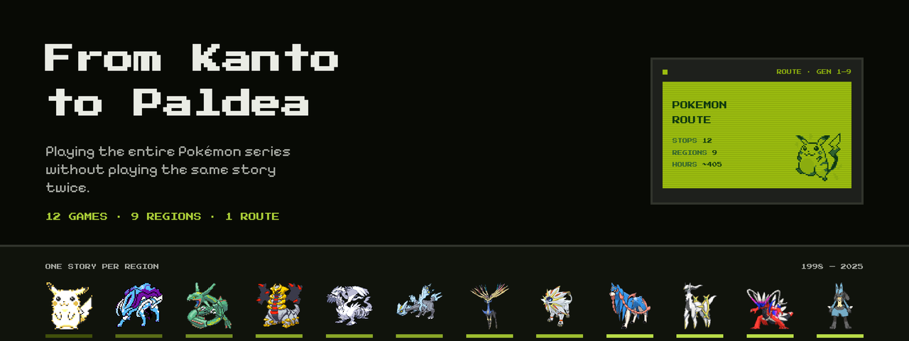
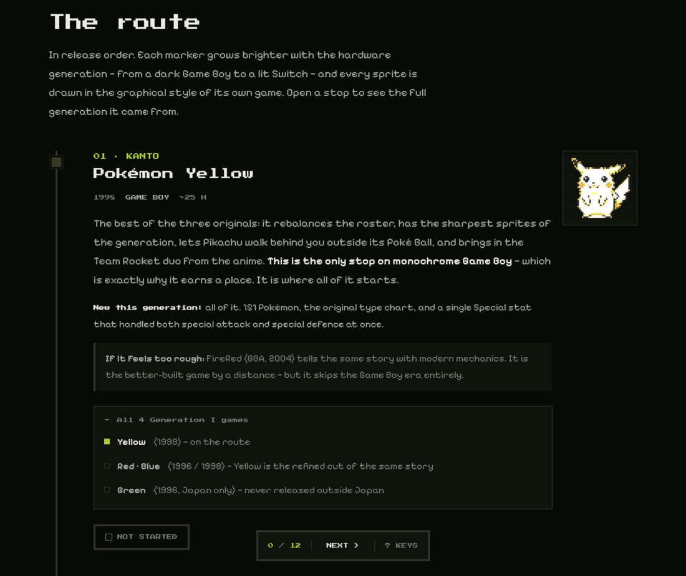
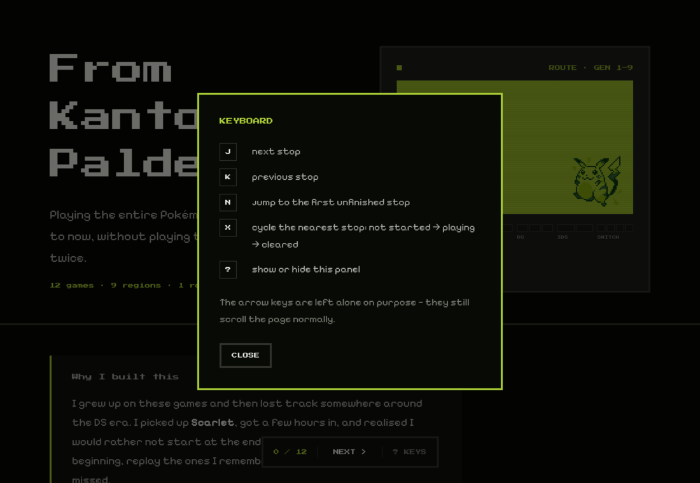

<div align="center">



<h1>From Kanto to Paldea</h1>

**A route for playing the entire Pokémon series, Generation 1 to Generation 9 —<br>twelve games, one story per region, nothing repeated.**

[**Open the site →**](https://pokemon.cativo.dev)

[](https://pokemon.cativo.dev)
[](https://github.com/cativo23/pokemon-route/actions)
[](LICENSE)
[](#built-with)

</div>

---

## What this is

Twenty-two mainline Pokémon games have shipped, but many of them tell **the same story twice**. Paired versions — Red and Blue, Scarlet and Violet — differ by a handful of exclusive Pokémon. Remakes revisit regions already covered: FireRed *is* Kanto, HeartGold *is* Johto, Let's Go is Kanto for the third time.

Strip that out and **twelve distinct stories** remain. That's the route.

Every stop opens to reveal the full generation it came from and which of its games were dropped, so nothing is hidden — just folded away.

<div align="center">

</div>

## Why it exists

I grew up on these games, lost the thread around the DS era, and picked up Scarlet years later. Rather than start at the end, I wanted to go back to the beginning — replay the ones I remember, and finally meet the ones I missed.

**The version picks are opinions, not facts.** Which cut is "definitive" is an argument the community has run for twenty years. Where a call is genuinely contested — Sun versus Ultra Sun, Crystal versus HeartGold — the page says so and offers the other option.

## The route

| # | Game | Year | Console | Region |
|---|------|------|---------|--------|
| 01 | Pokémon Yellow | 1998 | Game Boy | Kanto |
| 02 | Pokémon Crystal | 2000 | Game Boy Color | Johto |
| 03 | Pokémon Emerald | 2004 | Game Boy Advance | Hoenn |
| 04 | Pokémon Platinum | 2008 | Nintendo DS | Sinnoh |
| 05 | Pokémon Black | 2010 | Nintendo DS | Unova |
| 06 | Pokémon Black 2 | 2012 | Nintendo DS | Unova, two years on |
| 07 | Pokémon X | 2013 | Nintendo 3DS | Kalos |
| 08 | Pokémon Sun | 2016 | Nintendo 3DS | Alola |
| 09 | Pokémon Sword | 2019 | Nintendo Switch | Galar |
| 10 | Legends: Arceus | 2022 | Nintendo Switch | Hisui |
| 11 | Pokémon Scarlet | 2022 | Nintendo Switch | Paldea |
| 12 | Legends: Z-A | 2025 | Nintendo Switch | Kalos, Lumiose City |

Black 2 earns its own stop despite sharing a generation with Black: it is the series' only **direct sequel**, not another version.

## Features

- **Three-state progress** — not started → playing → cleared. On a route this long you sit on one game for months, and a checkbox cannot express that.
- **Playtime total** — clearing a stop adds its estimate to a running count parsed from the page itself, so the figure can never drift from the content.
- **A meter that reads two ways** — twelve cells grouped into the six hardware eras: how far along you are, and which console you're on, in one control.
- **Era-accurate sprites** — every sprite is drawn in the graphical style of its own game, so the art visibly evolves from 1998 to 2025 as you scroll.
- **Mechanical history** — each stop names what its generation introduced: Dark and Steel types, Abilities and Natures, the physical/special split, the Fairy type.
- **Keyboard navigation** — `J`/`K` walk the route, `N` jumps to the first unfinished stop, `X` cycles the nearest one, `?` lists them.

<div align="center">

</div>

## Built with

Hand-written HTML, CSS and JavaScript. No framework, no build step, no dependencies, no tracking, no analytics.

| | |
|---|---|
| Total weight | ~196 KB, sprites and sharing card included |
| JavaScript | ~8 KB, vanilla |
| Build step | none — `index.html` *is* the artifact |
| Runtime requests | fonts only; the page works offline after first load |
| Fonts | Press Start 2P + Pixelify Sans |

The design comes from the hardware itself. The accent is `#9BBC0F` — the real phosphor green of the Game Boy DMG screen — and the hero's four-tone palette is the only four tones that display could show. Route markers grow brighter with the hardware generation. Progress lives in `localStorage`; nothing leaves the browser.

```
index.html              the page
assets/tokens.css       colour, type, spacing and motion tokens
assets/styles.css       everything else
assets/app.js           progress, the scroll rail, keyboard navigation
assets/sprites/         12 era-accurate sprites + the hero Pikachu
assets/og.png           the card shown when the link is shared
assets/icon.png         favicon — the same Pikachu, on a DMG screen
tools/og.html           source of that card; render with tools/make-og.sh
tools/validate.py       the checks CI runs
deploy/                 nginx + compose, behind Traefik
docs/                   images for this README
```

## Running it locally

Any static server will do — there is nothing to build.

```bash
git clone https://github.com/cativo23/pokemon-route.git
cd pokemon-route
python3 -m http.server 8000
```

Then open <http://localhost:8000>.

## Checks

`tools/validate.py` enforces this project's own rules — no dependencies, standard library only. CI runs it on every push.

```bash
python3 tools/validate.py
```

It verifies that the HTML parses and every element closes, that every image has alt text and explicit dimensions, that every local file referenced exists and no sprite is orphaned, that **no literal colour or font escapes the token system**, that no token exists only in the dark palette, that the anti-pattern list stays empty (`transition: all`, `100vw`, italic headings, browser-default easing), that reduced motion and visible focus are honoured, and that **the advertised hour total matches the sum of the stops** — a check that caught a stale number the first time it ran.

It also guards the sharing card: that the image exists, that **the size declared in the page matches the actual PNG** (read from the IHDR header, no dependencies), and that it keeps the 1.91:1 ratio the networks crop to. Re-render the card at a different size and forget to update the tags, and CI stops you rather than the link quietly looking broken.

## Contributing

Corrections are welcome, especially factual ones — see [CONTRIBUTING.md](CONTRIBUTING.md). Version picks are opinions and I'll defend mine, but if a stated *fact* is wrong I want to know.

## Credits and licence

Sprites come from [PokeAPI's open sprite repository](https://github.com/PokeAPI/sprites), which indexes them **per game version** — that is what makes the era-accurate art possible. Generation IX has no per-version pixel sprites, so those were extracted from the first frame of an animated source and downscaled with point sampling. The hero Pikachu is the genuine Red/Blue monochrome sprite, remapped to real DMG screen colours.

The code here is [MIT licensed](LICENSE). **The sprites are not mine and are not covered by it.**

Pokémon is a trademark of Nintendo, Creatures Inc. and GAME FREAK. This is a fan project, unaffiliated with and unendorsed by any of them. No game files are hosted or linked — emulators are legal software, and the clean path to the games is dumping cartridges and consoles you own.

<div align="center">

Built by [Carlos Cativo](https://cativo.dev) · [@cativo23](https://github.com/cativo23)

</div>
